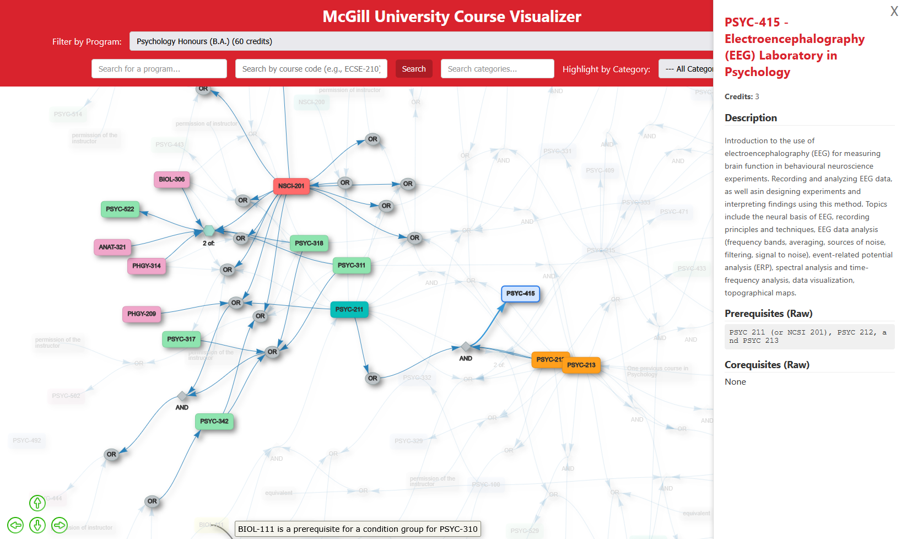

# McGill Course Visualizer

[](https://www.python.org/)
[](https://developer.mozilla.org/en-US/docs/Web/JavaScript)
[](https://scrapy.org/)
[](https://ai.google.dev/)
[](https://opensource.org/licenses/MIT)

> An interactive dependency graph visualizer for McGill University's course catalogue, powered by a Scrapy data pipeline and an LLM-based prerequisite parser.

This tool transforms McGill's static, text-based course catalogue into a dynamic and intuitive interactive graph, allowing students and advisors to easily explore course dependencies, program requirements, and academic pathways.




---

## Table of Contents

- [McGill Course Visualizer](#mcgill-course-visualizer)
  - [Table of Contents](#table-of-contents)
  - [About The Project](#about-the-project)
  - [Key Features](#key-features)
  - [Tech Stack](#tech-stack)
  - [System Architecture](#system-architecture)
  - [Getting Started](#getting-started)
    - [Prerequisites](#prerequisites)
    - [Installation \& Data Pipeline](#installation--data-pipeline)
  - [Usage](#usage)
  - [Technical Challenges \& Lessons Learned](#technical-challenges--lessons-learned)
    - [1. Parsing Unstructured and Ambiguous Prerequisite Text](#1-parsing-unstructured-and-ambiguous-prerequisite-text)
    - [2. Efficiently Processing 2,000+ Courses with an External API](#2-efficiently-processing-2000-courses-with-an-external-api)
  - [Future Improvements](#future-improvements)
  - [License](#license)

---

## About The Project

University course catalogues are often presented as dense, static lists, making it difficult for students to visualize course dependencies and effectively plan their degree. A student might not realize a foundational course is a prerequisite for multiple advanced electives until it's too late, causing registration delays.

This project solves that problem by creating a comprehensive, end-to-end data pipeline that:
1.  **Scrapes** all course and program data directly from McGill's official catalogue.
2.  **Enriches** the data by intelligently parsing complex, human-written prerequisite strings into a structured, machine-readable format using the Google Gemini LLM.
3.  **Presents** the final data in a fully interactive, searchable, and filterable dependency graph.

The result is a powerful planning tool that provides clarity and insight into the academic landscape of McGill University.

---

## Key Features

-   **Interactive Graph Visualization:** Pan, zoom, and explore the entire course network. Click on any course to see its details and connections.
-   **Intelligent Prerequisite Parsing:** Leverages a Large Language Model (LLM) to accurately interpret complex requirement text (e.g., `"Course A and (Course B or Course C)"`) and model it as a logical tree.
-   **Advanced Filtering & Highlighting:** Instantly filter the graph by academic program (e.g., "Honors Computer Science") or highlight courses by subject category (e.g., "ECSE", "MATH").
-   **Detailed Course Information:** An elegant sidebar provides complete details for any selected course, including its title, description, credits, and raw prerequisite text.
-   **Efficient Data Pipeline:** The entire backend process is automated, from web scraping with Scrapy to concurrent data processing with `asyncio`.

---

## Tech Stack

The project is built with a modern and robust set of technologies, separating the data pipeline from the lightweight frontend.

| Category                | Technologies                                                                          |
| ----------------------- | ------------------------------------------------------------------------------------- |
| **Frontend**            | `HTML5`, `CSS3`, `JavaScript (ES6+)`, `Vis.js (vis-network)`                            |
| **Backend/Data Pipeline** | `Python 3.10+`, `Scrapy`                                                              |
| **AI & Data Processing**  | `Google Gemini API`, `Asyncio`, `Aiohttp`                                             |
| **Data & Environment**    | `JSON`, `Python Venv`, `Dotenv`                                                       |

---

## System Architecture

The project operates on a three-stage data pipeline architecture, designed for modularity and scalability.

`[INSTRUCTION: A simple diagram here would be very effective. You can create one easily with tools like diagrams.net (draw.io) and embed the image. Here is a text version you can use as a guide:]`

**`[Web (McGill Catalogue)] -> [1. Scrapy Spiders] -> [Raw JSON Data] -> [2. Python Enrichment Script (Gemini API)] -> [Processed JSON Data] -> [3. Frontend (Vis.js)]`**

1.  **Stage 1: Data Acquisition (Scrapy)**
    -   `course_spider.py`: Crawls individual course pages, extracting details like title, description, credits, and the raw, unstructured prerequisite text.
    -   `program_spider.py`: Navigates the faculty and program sitemaps to gather lists of courses required for each academic program.
    -   The output is a set of raw JSON files containing the scraped information.

2.  **Stage 2: Data Enrichment (Python/LLM)**
    -   `process_prerequisite.py`: Orchestrates the processing. It reads the raw course data and identifies courses needing prerequisite parsing.
    -   `parallel_gemini_requester.py`: An asynchronous client that sends the prerequisite text to the Google Gemini API in highly concurrent batches. It manages rate limits, retries, and error handling using `asyncio` and `aiohttp`.
    -   `llm_batch_prompt_template.txt`: A carefully engineered prompt that instructs the LLM to act as an academic advisor and convert unstructured text into a precise, logical JSON structure.
    -   The output is a final, clean JSON file ready for consumption by the frontend.

3.  **Stage 3: Data Presentation (Frontend)**
    -   A vanilla JavaScript, static single-page application that loads the final processed JSON data.
    -   It uses the `vis-network` library to render the nodes (courses, logic gates) and edges (dependencies) in an interactive canvas.
    -   All filtering, searching, and UI logic is handled client-side for a fast and responsive user experience.

---

## Getting Started

Follow these instructions to set up and run the project locally.

### Prerequisites

-   Python 3.10 or higher
-   `pip` and `venv`
-   A Google Gemini API Key. You can obtain one from [Google AI Studio](https://aistudio.google.com/app/apikey).

### Installation & Data Pipeline

1.  **Clone the repository:**
    ```sh
    git clone https://github.com/your-username/mcgill-course-visualizer.git
    cd mcgill-course-visualizer
    ```
2.  **Set up a Python virtual environment:**
    ```sh
    python -m venv venv
    source venv/bin/activate  # On Windows, use `venv\Scripts\activate`
    ```
3.  **Install dependencies:**
    ```sh
    pip install -r requirements.txt
    ```
4.  **Set up your API Key:**
    -   Create a file named `.env` inside the `processing_scripts/` directory.
    -   Add your API key to this file:
        ```env
        # processing_scripts/.env
        GEMINI_API_KEY="YOUR_API_KEY_HERE"
        ```
5.  **Run the Data Pipeline:**
    -   **Step 5a: Scrape the data (Optional, raw data is included):**
        To re-scrape the data from McGill's website, navigate to the scraper directory and run the spiders. The output will be saved as JSON.
        ```sh
        # (This may take a while)
        scrapy crawl mcgill_course_info -o data/mcgill_courses_raw.json
        scrapy crawl mcgill_programs -o data/programs_and_courses.json
        ```
    -   **Step 5b: Process the data with the LLM:**
        Run the processing script to parse the prerequisites and generate the final `mcgill_courses_processed.json` file.
        ```sh
        cd processing_scripts
        python process_prerequisite.py
        ```
        This script will use the existing `mcgill_courses_raw.json` and generate `mcgill_courses_processed.json` in the `data/` directory. It is designed to be resumable.

## Usage

Once the data pipeline has been successfully run, simply open the `index.html` file in your web browser.

-   Use the **"Filter by Program"** dropdown to load the dependency graph for a specific academic program.
-   Use the **search bars** to find a specific course or filter by a course category.
-   **Click and drag** nodes to rearrange the graph for better clarity.
-   **Click on a course node** to view its detailed information in the right-hand sidebar.

---

## Technical Challenges & Lessons Learned

This project presented two significant technical challenges that were critical to its success.

### 1. Parsing Unstructured and Ambiguous Prerequisite Text

-   **The Problem:** Course prerequisites on the university website are written in natural language (e.g., *"ECSE 200 and MATH 262, or permission of instructor."*). This free-form text contains complex logical combinations (`AND`, `OR`, nesting) that are impossible to model reliably with regular expressions alone.
-   **The Solution:** I engineered a solution using a Large Language Model (LLM). I created a highly detailed prompt (`llm_batch_prompt_template.txt`) that instructs the Google Gemini model to act as a "precision-focused academic advisor automaton." This prompt provides a strict JSON schema and multiple examples, guiding the model to accurately convert the natural language into a structured, logical tree with `AND`/`OR` operators, course codes, and other textual conditions.
-   **What I Learned:** This was a deep dive into **practical prompt engineering** and **leveraging LLMs for structured data extraction**. I learned how to constrain a powerful model to produce consistent, machine-readable output, effectively turning it into a reliable component in a data pipeline.

### 2. Efficiently Processing 2,000+ Courses with an External API

-   **The Problem:** The data enrichment stage required sending over 2,000 individual API requests to the Gemini model. A sequential, synchronous approach would have been incredibly slow (taking hours) and would have been highly susceptible to failure from network errors or API rate limits.
-   **The Solution:** I built a robust, asynchronous request handler (`parallel_gemini_requester.py`) using Python's **`asyncio`** and **`aiohttp`** libraries. This script uses an `asyncio.Semaphore` to manage concurrency, sending dozens of requests in parallel without overwhelming the API. It also implements an automatic, **exponential backoff retry mechanism** to gracefully handle transient HTTP errors (like 429 Too Many Requests), ensuring the entire batch completes successfully.
-   **What I Learned:** This project provided significant hands-on experience in **asynchronous programming in Python**. I gained a practical understanding of building high-throughput, resilient I/O-bound applications, managing API rate limits, and structuring `async`/`await` code for clarity and performance.

---

## Future Improvements

-   **Implement a Database:** Replace the static JSON files with a proper database (e.g., PostgreSQL or SQLite) and a lightweight backend API (e.g., Flask or FastAPI). This would allow for more dynamic data updates and scalability.
-   **Add Unit & Integration Testing:** Introduce a testing framework like `pytest` to validate the scraping logic, the data processing functions, and the API interaction layer.
-   **Containerize with Docker:** Package the entire data pipeline into a Docker container for simplified, one-command setup and deployment.
-   **Degree Progress Tracking:** Enhance the frontend to allow users to select courses they have completed, visually highlighting which courses are now unlocked and their progress towards a degree.

---

## License

Distributed under the MIT License. See `LICENSE` for more information.